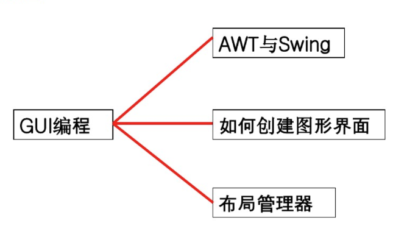

[TOC]

## 写在前面

最近因为领导让写一个小工具，临时要一个界面，所以临时突击用GUI写了一个界面，过了好久想梳理一下GUI的整体架构,梳理到最后，发现涉及的东西越来越多，所以本文进行一个总结和扩展

本文章包含内容 

- awt 和 swing 的区别
- awt 介绍
  - 容器介绍
  - 组件介绍
- swing 介绍
  - 容器介绍
  - 组件介绍
- 布局管理器
- 事件处理
- GUI 中的MVC模型
- 设计模式

## GUI概述

- 早期，电脑向用户提供的是单调、枯燥、纯字符状态的命令行界面。后来Apple公司率先在电脑的操作系统中实现了图形化用户界面（Graphical User interface，简称GUI），但由于Apple公司封闭的市场策略，自己完成电脑硬件、操作系统、应用软件一条龙的产品，与其它不兼容，使得Apple错过一次一统全球PC的好机会

- 后来，Microsoft 推出了风靡全球的Windows操作系统，wondows 凭借着优秀的图形化用户界面，一举稳固了操作系统标准的地位

- 在图形化风靡的今天，java语言也提供了一套可以轻松构建GUI的工具

  ​

  > [java GUI 简介](https://wenku.baidu.com/view/f35020f74a649b6648d7c1c708a1284ac85005ad?aggId=f35020f74a649b6648d7c1c708a1284ac85005ad&fr=catalogMain_)

java 主要提供了三个主要的包做GUI开发：

| 包              | 功能                  | 备注   |
| :------------- | ------------------- | ---- |
| java.awt       | 提供字体/布局管理器          |      |
| javax.swing    | 主要提供各种组件（窗口/按钮/文本框） |      |
| java.awt.event | 事件处理，后台功能实现         |      |

### awt 和 swing 的区别

- awt 是抽象窗口工具包，是sun针对java gui 变成提供的最早的开发工具包，用来建立和设置java图形用户界面，这个工具包主要是提供了一套与本地图形界面交互的接口。awt 中的图形函数与操作系统所提供的图形函数之间有着一一对应的关系。也就是说，当我们利用awt建立图形用户界面的时候，实际上实在利用操作系统所提供的图形库。不过由于不同操作系统之间的图形库所提供的功能不完全一样，所以在一个平台上存在的功能在另一个平台上则可能不存在，就导致一些应用和层序在测试时界面非常美观，一旦移植到其他的操作系统平台上后就变得“惨不忍睹”，为了实现java 的“一次编译，处处运行”，awt 不得不牺牲一些功能来满足平台无关性，其所提供的图形功能被定格为各种通用型操作系统所提供的图形功能的交集。由于AWT是依靠本地方法来实现其功能的，所以通常把AWT组件称之为**重量级组件**。
- - swing 是在awt 基础上重新构建的新的图形界面系统，它提供了awt 所能够提供的所有功能，并且用纯粹的java代码对awt 功能进行了大幅度的扩充。所有的swing 实际上也是awt的一部分。swing 对基于对等体的组件使用的术语是重量级，对于模拟的组件使用的术语是轻量级。实际上，swing可以支持在一个GUI中混合使用重量级组件和轻量级组件，不过一般将其称之为**轻量级组件**。
    - 丰富的组件类型:Swing提供了非常广泛的标准组件。这些组件和SWT一样丰富。基于它良好的可扩展性，除了标准组件，Swing还提供了大量的第三方组件。许多商业或开源的Swing组件库在开发多年后都已经可以方便地获取了。
    - 丰富的组件特性:Swing不仅包含了所有平台上的特性，它还支持根据程序所运行的平台来添加额外特性。Swing组件特性遵循特定原则，易于扩展，因此能够提供较SWT和AWT更多的功能。
    - 好的组件API模型支持:Swing遵循MVC模式，这是一种非常成功的设计模式。它的API成熟并设计良好。经过多年的演化，Swing组件APIs变得越来越强大，灵活和可扩展。它的API设计被认为是最成功的GUI API之一。较之SWT和AWT更面向对象，也更灵活而可扩展。
    - 标准的GUI库：Swing和AWT一样是JRE中的标准库。因此，你不用单独地将它们随你的应用程序一起分发。它们是平台无关的，不用担心平台兼容性。
    - 成熟稳定：由于它是纯Java实现的，不会有SWT的兼容性问题。Swing在每个平台上都有相同的性能，不会有明显的性能差异。
    - 可扩展和灵活性。Swing完全由Java代码实现。Swing基于MVC的结构使得它可以发挥Java作为一门面向对象语言的优势。它提供了许总体上良好的性能。

**区别**

​	Swing是AWT的扩展，它提供了许多新的图形界面组件。Swing组件以“J”开头，除了拥有与AWT类似	的按钮（JButton)、标签（JLabel)、复选框（JCheckBox)、菜单（JMenu）等基本组件外，还增加了一个丰富的高层组件集合，如表格（JTable）、树（JTree）。在javax.swing包中，定义了两种类型的组件：顶层容器（Jframe、Japplet、JDialog和JWindow）和轻量级组件。

​	使用swing 组件创建程序是因为它比AWT更专业，而且swing 提供更多得附加元素。比如说，通过Swing 和JEditorPanel 组件可以在java程序中使用HTML格式文本。而AWT实现同样功能不但苦难你，而且要花费相当多的时间

 	swing 并不能使程序更加容易编写，但是可以使程序更加美观，而且容易在其他平台上运行。swing 组件比一般AWT 组件强大的多

​	awt 分为两部分，一部分可以安全的混入swing 类，另一部分要用swing的等价类对其替换

## 组件与容器

组件：基本图形元素，如按钮，文本框域，多选按钮，单选按钮等。

容器：可以容纳组件的区域，在容器上加别的组件。如：Frame，Window等。

注意：容器中可以容纳组件，也可以容纳比它的“容器小”的容器。

### 顶级容器

| 容器      | 功能                                       | 备注   |
| ------- | ---------------------------------------- | ---- |
| Jframe  | 用于框架窗口的类，此窗口嗲有边框、标题、用于关闭和最小化窗口的图标等。带GUI的应用程序通常至少使用一个框架窗口 |      |
| JDialog | 用于对话框的类                                  |      |
| JApplet | 用于使用Swing 组件的Java Applet 的类              |      |

### 中间容器

| 容器          | 功能                               | 备注   |
| ----------- | -------------------------------- | ---- |
| JPanel      | 最灵活，最常用的中间组件                     |      |
| JScrollPane | 与JPanel 类似，但还可在大的组件或可扩展组件周围提供滚动条 |      |
| JTabbedPane | 包含多个组件，但一次只显示一个组件。               |      |
| JToolBar    | 按行或列排列一组组件（通常是按钮）                |      |

JPanel 容器

- JPanel 是最简单的容器类，应用程序可以将其他组件放在面板提供的空间内。
- JPanel 只能存在于其他的容器（windows 或其子类）中，一般被放入Frame
- JFrame 可以被划分为若干个JPanel,然后在JPanel 上进一步进行组件布局
- 面板的默认布局管理器是FlowLayout 布局管理器
- 不能为JPnel设置标题

| 函数原型                                 | 说明                |
| ------------------------------------ | ----------------- |
| JPanel()                             | 创建默认布局（FlowLayot） |
| Jpanel(LayoutManager layout)         | 以指定的布局管理器创建面板     |
| void setLayout(LayoutManager layout) | 以指定布局管理器设置面板的布局   |
| Component add(Component comp)        | 往面板内添加控件          |
| void setBackgroud(Color bg)          | 设置面板的背景色          |

## AWT

java.awt 包是Java内置的包，属于java 基本类库的一部分，其中包括以下内容：

- 便于用户输入的一组丰富的界面组件
- 将组件放置在适当位置的几种布局管理器
- 事件处理模型
- 图形和图像工具类

https://wenku.baidu.com/view/5314a4e2524de518964b7dca?aggId=f35020f74a649b6648d7c1c708a1284ac85005ad&fr=catalogMain_text_ernie_recall_v1:wk_recommend_main5

## Swing

111

## 参考

>https://wenku.baidu.com/view/7359ce5c59cfa1c7aa00b52acfc789eb172d9e6a.html?fr=sogou&_wkts_=1682501687164
>
>https://developer.aliyun.com/article/800083
>
>https://www.cnblogs.com/kohler21/p/16214218.html
>
>https://wenku.baidu.com/view/f4cef007ac45b307e87101f69e3143323968f59c.html?fr=sogou&_wkts_=1682501700680
>
>https://www.cnblogs.com/cxf-tech/p/15256806.html

